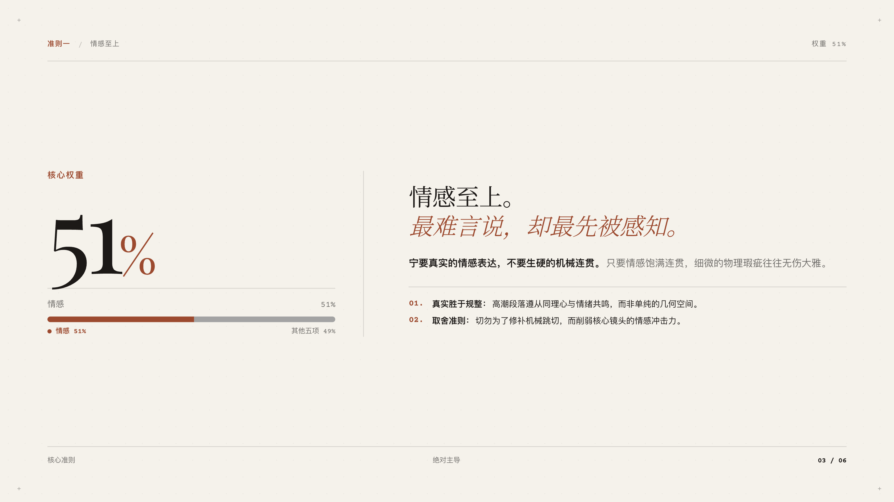
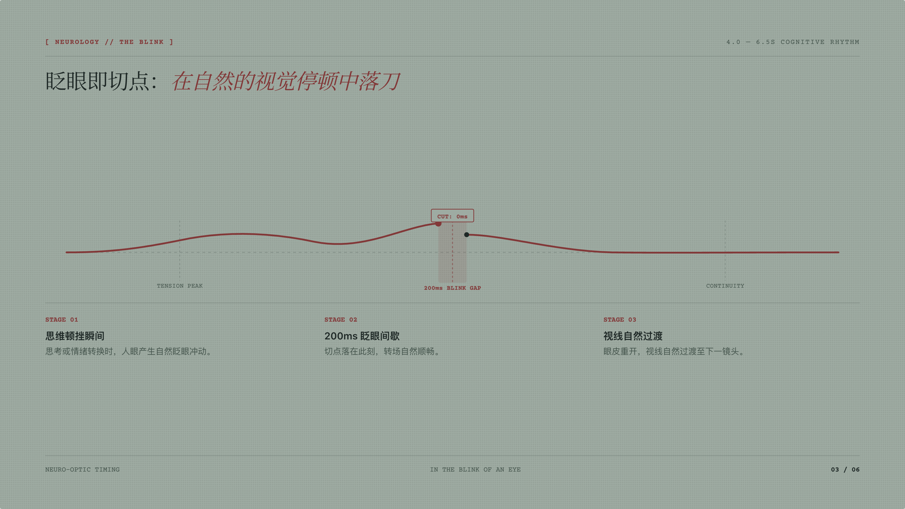
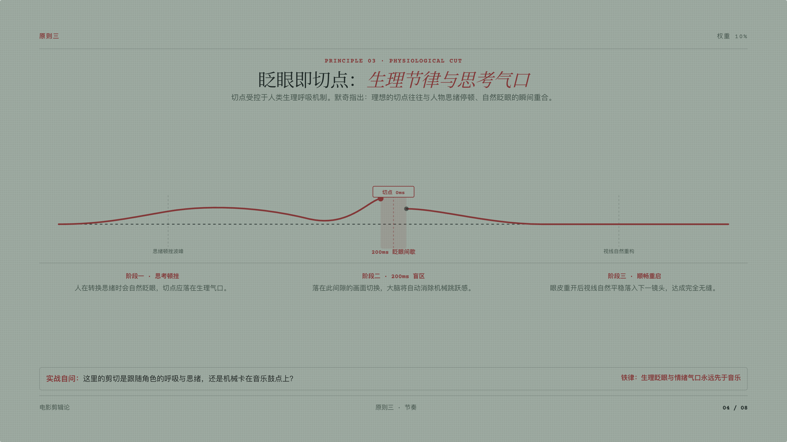
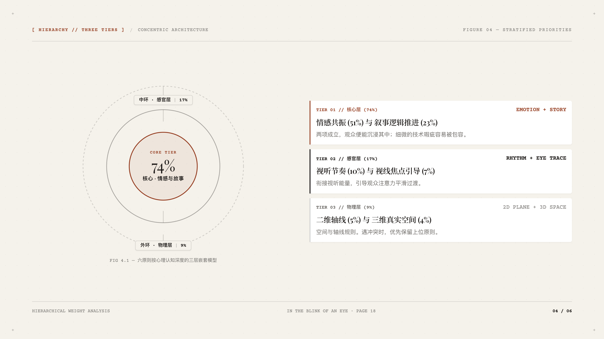

# Quiet Slides

<div align="center">

[](LICENSE)
[]()
[]()
[]()

**Radical Simplicity. Content-First Typography.**  
A modern web-based 16:9 presentation deck suite engineered for design purists, keynote speakers, and academic researchers.

[中文文档](README.md) · [Design Principles](docs/design_principles.md) · [Shortcuts Guide](docs/keyboard_shortcuts.md)

</div>

---

## 📸 Visual Showcase

### 1. Dual Aesthetic Systems

Quiet Slides rejects rigid corporate templates, offering two distinct handcrafted visual styles:

| Style A · Artisan Paper (物料档案版) | Style B · Minimal Luxury Editorial (静奢编辑版) |
| :---: | :---: |
| [](assets/screenshots/hero_artisan.png) | [](assets/screenshots/hero_editorial.png) |
| **Feel**: 400gsm tactile cotton paper fiber, workshop manuscript typography, typewriter metadata, and physical stamped seals. | **Feel**: Smooth warm neutral paper, 0.5–1px hairline gridlines, micro crosshairs, and 4-part classical editorial typography. |

---

### 2. Bespoke Typographic Architecture

We adhere to the **Zero-Template Doctrine** — every slide layout is derived directly from the conceptual logic of the thesis:

| Core Concept | Style A · Artisan Material Expression | Style B · Minimal Editorial Expression |
| :--- | :---: | :---: |
| **51% Rule of Emotion**<br>Weight & Polarizing Tension | [](assets/screenshots/artisan_s2_tension.png)<br>*51% vs 49% Asymmetrical Tension Field* | [](assets/screenshots/editorial_s3_statement.png)<br>*Giant Typography Statement & 2-Line Definition* |
| **Blink & Neural Rhythm**<br>Physiological Flow & Causality | [](assets/screenshots/artisan_s3_waveform.png)<br>*Blink Impulse & Neural Rhythm Dual Waveforms* | [](assets/screenshots/editorial_s2_loop.png)<br>*Attention Focus & Cutpoint Perceptual Loop* |
| **Hierarchy & Sacrifice**<br>Structural Layers & Concentrics | [](assets/screenshots/artisan_s4_staircase.png)<br>*Bottom-Up 6-Step Sacrifice Pyramid Staircase* | [](assets/screenshots/editorial_s4_concentric.png)<br>*Hairline 3-Tier Core Radiation Concentric Rings* |

---

### 3. All-Palette & Diverse-Layout Matrix

Each aesthetic system is paired with curated traditional paper base colors. Each colorway is captured on a different slide layout with automatic high-contrast callout adaptation complying with **WCAG AAA** readability standards.

#### Style A · Artisan Paper Palette Matrix (9 Chinese Traditional Colors)

| 01. 竹月青 (Celadon) | 02. 赭石褐 (Terracotta) | 03. 秋香黄 (Butter) |
| :---: | :---: | :---: |
| [](assets/screenshots/palette_artisan_1_celadon_s1.png) | [](assets/screenshots/palette_artisan_2_terracotta_s2.png) | [](assets/screenshots/palette_artisan_3_butter_s3.png) |
| `Slide 1` · Asymmetrical Cover & Workshop Seal | `Slide 2` · 51% Weight Contrast Field | `Slide 3` · Blink & Cognitive Waveforms |
| **04. 松针绿 (Olive)** | **05. 晚山粉 (Blush)** | **06. 素绢白 (Beige)** |
| [](assets/screenshots/palette_artisan_4_olive_s4.png) | [](assets/screenshots/palette_artisan_5_blush_s5.png) | [](assets/screenshots/palette_artisan_6_beige_s6.png) |
| `Slide 4` · 6-Step Priority Staircase | `Slide 5` · 2D Screen & 180° Spatial Axis | `Slide 6` · Intentional Whitespace Conclusion |
| **07. 初生翠 (Pistachio)** | **08. 苍烟灰 (Oyster)** | **09. 玄墨金 (Laid)** |
| [](assets/screenshots/palette_artisan_7_pistachio_s2.png) | [](assets/screenshots/palette_artisan_8_oyster_s4.png) | [](assets/screenshots/palette_artisan_9_laid_s1.png) |
| `Slide 2` · High Contrast on Light Green | `Slide 4` · Concrete Gray Staircase | `Slide 1` · Dark Paper with Gold Highlights |

#### Style B · Minimal Editorial Palette Matrix (6 Chinese Traditional Colors)

| 01. 墨染宣 (Ecru & Charcoal) | 02. 松霜绿 (Alabaster & Olive) | 03. 秋茶褐 (Sand & Umber) |
| :---: | :---: | :---: |
| [](assets/screenshots/palette_editorial_1_ecru_s1.png) | [](assets/screenshots/palette_editorial_2_alabaster_s2.png) | [](assets/screenshots/palette_editorial_3_sand_s3.png) |
| `Slide 1` · Hairline Grid Cover & TOC | `Slide 2` · Focus & Perceptual Loop | `Slide 3` · Clear Statement & Definition |
| **04. 黛蓝笺 (Parchment & Navy)** | **05. 岩石灰 (Chalk & Slate)** | **06. 浓萃咖 (Cream & Espresso)** |
| [](assets/screenshots/palette_editorial_4_navy_s4.png) | [](assets/screenshots/palette_editorial_5_slate_s5.png) | [](assets/screenshots/palette_editorial_6_espresso_s6.png) |
| `Slide 4` · 3-Tier Concentric Model | `Slide 5` · Spatial Matrix & Guidance | `Slide 6` · Calm Editorial Conclusion |

---

### 4. Interactive Deck Engine

| True Fullscreen Presentation | Inline Copy Editing | Palettes & Shortcuts Guide |
| :---: | :---: | :---: |
| [](assets/screenshots/feature_fullscreen.png) | [](assets/screenshots/feature_inline_edit.png) | [](assets/screenshots/feature_drawer.png) |
| Press `F` for fullscreen. Controls hide automatically while a minimalist bottom indicator pill floats into view. | Press `E` to edit copy directly on screen. Save instantly with `Cmd+S`. | Click top right to switch paper palettes in real time. Click `?` or press `?` to toggle the shortcuts guide modal. |

---

## 🌟 Key Highlights

### 1. Strict Word Budget & 3-Second Rule
- **Word Limit**: Strictly **≤ 35–50 words** per slide. Eliminate clutter, bullet point dumps, and walls of text.
- **3-Second Rule**: The audience grasps the core thesis within 3 seconds.
- **Natural Whitespace**: Comfortable whitespace serves to elevate the core message.

### 2. Content-Driven Layout
- Layouts are derived organically from the core concept—never forced into rigid cards.
- Clear visual structures: Contrast fields, neural blink waveforms, bottom-up priority staircases, and concentric circles.

### 3. Practical Interactive Features
- **16:9 Aspect Ratio Scaling**: Native JS transform engine ensures exact 16:9 ratio across any screen.
- **True Fullscreen Mode**: HTML5 Fullscreen API with floating indicator pill and hidden navigation buttons.
- **Baked HTML Export**: Saves live edits and active color schemes directly into static HTML source code. Works offline on any device.
- **Clean 16:9 PDF Export**: Multi-page landscape PDF export via `window.print()` (`P` key) or headless Puppeteer CLI.
- **Inline Editing**: Press `E` to edit text directly on screen, with `Cmd+S` auto-persistence.
- **Granular 3-Way Smart Merge**: Seamless human-AI collaboration. When you customize copy in the browser and later ask AI to adjust layout or code, the fingerprinting engine preserves 100% of your unconflicted edits while adopting AI updates, complete with an instant diff & revert card.

---

## ⌨️ Keyboard Shortcuts

| Shortcut | Action | Description |
| :--- | :--- | :--- |
| **`→` / `Space` / `PageDown`** | Next Slide | Transitions forward and triggers GSAP timeline |
| **`←` / `PageUp`** | Previous Slide | Transitions backward |
| **`F`** | **True Fullscreen** | Native browser fullscreen with floating bottom pill |
| **`Esc`** | Exit / Close Modal | Exit fullscreen presentation, close shortcuts modal, or drop editing focus |
| **`?` / `/`** | **Shortcuts Guide** | Toggle frosted glass keyboard shortcuts guide card |
| **`E`** | **Edit Copy** | Toggle WYSIWYG inline text editing |
| **`Cmd + S` / `Ctrl + S`** | Save Copy | Persist edits to local browser storage |
| **`P`** | **Export PDF** | Print/export all 6 slides in strict 16:9 ratio |
| **`R`** | Replay Animations | Re-run GSAP entrance choreography |

---

## 📂 Project Structure

```
quiet-slides/
├── SKILL.md                          # Antigravity Agent Core Skill Specification
├── README.md                         # Chinese Documentation (Visual Gallery)
├── README.en.md                      # English Documentation (Visual Gallery)
├── LICENSE                           # License (Free Non-Commercial / Commercial Inquiry)
├── assets/
│   └── screenshots/                  # 2x Retina High-DPI Showcase Captures
├── showcases/
│   └── editing_principles/           # Six Principles of Editing Double Deck Showcase
│       ├── demo_showcase.html        # Dual-Style Comparison Center
│       ├── editing_principles_artisan.html   # Style A Artisan Paper Deck
│       └── editing_principles_editorial.html # Style B Minimal Editorial Deck
├── templates/
│   ├── starter_artisan.html          # Style A Starter Template
│   └── starter_editorial.html        # Style B Starter Template
├── scripts/
│   ├── export_pdf.js                 # Headless Chrome 16:9 Multi-page PDF Export
│   └── export_clean_html.js          # Headless Chrome Clean Baked HTML Export
└── docs/
    ├── design_principles.md          # Core Design Doctrine & Typography Architecture
    └── keyboard_shortcuts.md         # Interactive Deck Engine & Shortcut Guide
```

---

## 🚀 Quick Start

### 1. View Locally
Open any of the showcase decks directly in any modern browser—no build step or backend required:
- Dual-style comparison center: `showcases/editing_principles/demo_showcase.html`
- Style A (Artisan Paper): `showcases/editing_principles/editing_principles_artisan.html`
- Style B (Minimal Editorial): `showcases/editing_principles/editing_principles_editorial.html`

### 2. Export Clean Offline HTML
1. Open any deck in your browser, press `E` to customize the copy, and choose your preferred paper palette from the drawer.
2. Click **"Export Clean HTML"** in the top navigation bar.
3. Download a standalone, zero-dependency HTML file ready for keynote presentations on any computer!

### 3. Automated PDF Export via CLI
```bash
# Install Puppeteer
npm install puppeteer

# Export Artisan 16:9 PDF
node scripts/export_pdf.js showcases/editing_principles/editing_principles_artisan.html my_deck.pdf
```

---

## 📜 License & Usage Terms

This project is licensed under the **[CC BY-NC-SA 4.0](LICENSE) (Creative Commons Attribution-NonCommercial-ShareAlike 4.0 International License)**.

- **Free for Non-Commercial Use**: Free for personal study, academic research, non-profit talks, and educational presentations (attribution required, share-alike).
- **Commercial Use Requires Permission**: Any commercial use—including corporate keynotes, commercial client deliverables, paid workshops/courses, or commercial product integration—**strictly requires prior authorization and a commercial license**.
- **Commercial Licensing Inquiries**: For commercial licenses, enterprise branding, or sponsorship collaborations, please reach out via [GitHub Issues / Discussions](https://github.com/qgpuerr/quiet-slides/issues).
