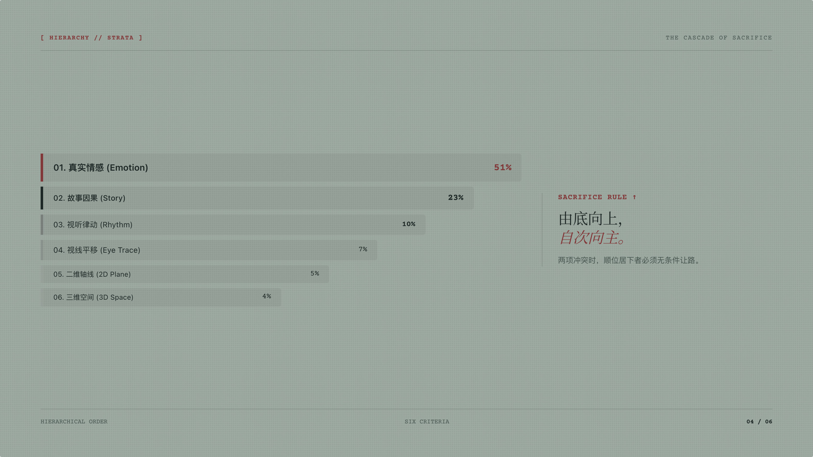
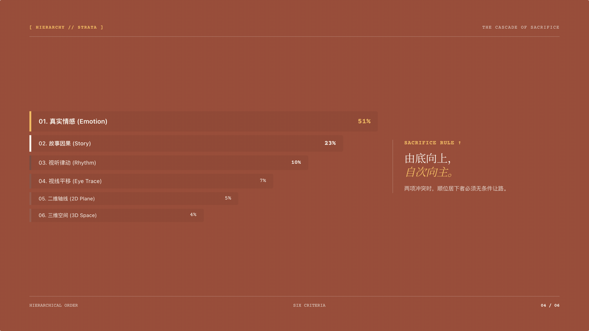
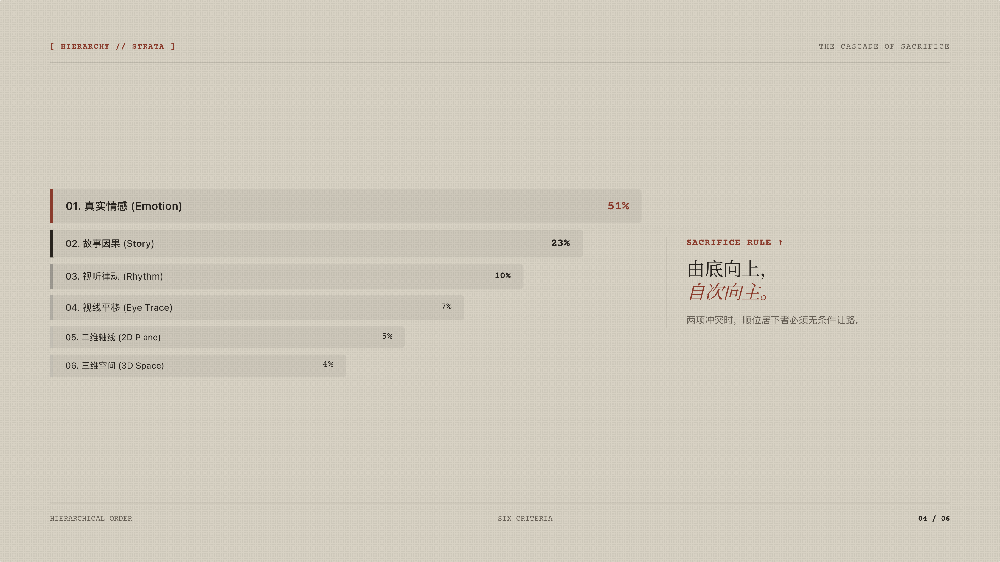
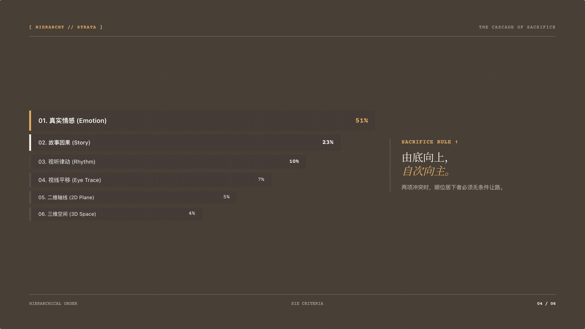
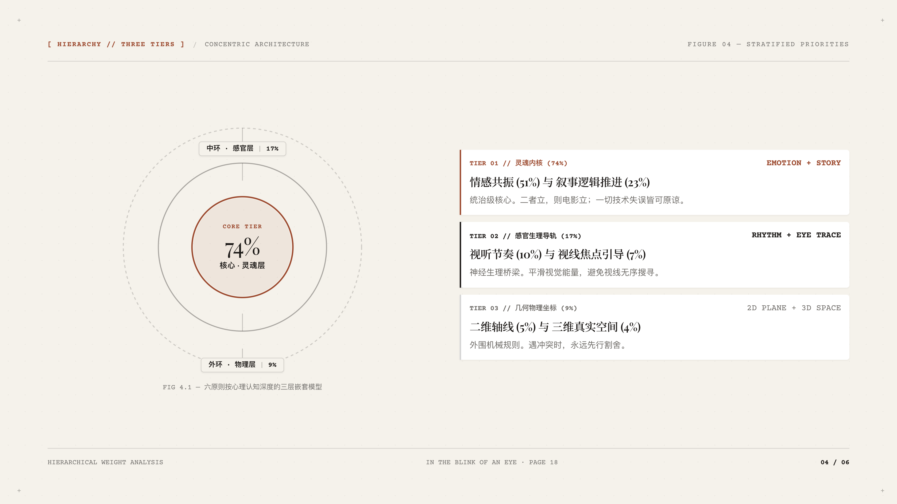
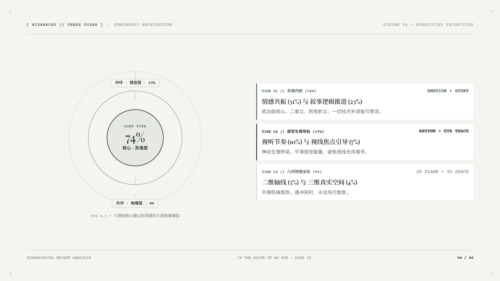
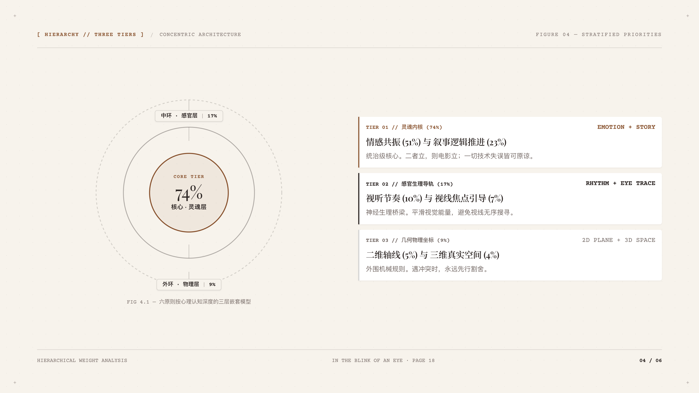
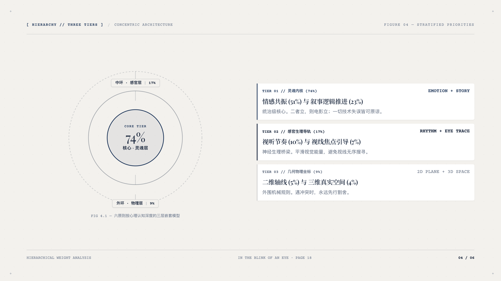

# Quiet Slides (静谧幻灯片)

<div align="center">

[](LICENSE)
[]()
[]()
[]()

**大道至简，重归内容原发排版。**  
为高审美演讲者、设计师、学术作者打造的现代化网页端 16:9 幻灯片套件。

[English Documentation](README.en.md) · [查看核心设计哲学](docs/design_principles.md) · [交互与快捷键指南](docs/keyboard_shortcuts.md)

</div>

---

## 📸 视觉画廊 (Visual Showcase)

### 1. 双生美学风格对比 (Dual Aesthetic Systems)

Quiet Slides 摒弃千篇一律的扁平卡片模版，提供两套经过严格排印考究的静奢美学体系：

| Style A · 物料档案版 (Artisan Paper) | Style B · 静奢编辑版 (Minimal Luxury Editorial) |
| :---: | :---: |
| [](assets/screenshots/hero_artisan.png) | [](assets/screenshots/hero_editorial.png) |
| **质感**：400gsm 棉质纸张微距纤维、工作台手稿排印、打字机元数据印章、沉着工手感 | **质感**：平滑暖调纸基、0.5–1px 极细发丝网格、微距十字基准线、经典编辑四声部 |

---

### 2. 独创排版架构 (Bespoke Typographic Architecture)

我们坚持 **“零模版教条”** —— 拒绝套用固定网格或卡片，排版构图必须完全由核心命题的因果与空间关系原发生长。

| 核心命题 | Style A · 物料档案版视觉呈现 | Style B · 静奢编辑版视觉呈现 |
| :--- | :---: | :---: |
| **51% 剪辑法则**<br>情感权重与极化对抗 | [](assets/screenshots/artisan_s2_tension.png)<br>*51% vs 49% 巨号无框空间对抗场* | [](assets/screenshots/editorial_s3_statement.png)<br>*跨栏巨号陈述与极简两行定义* |
| **生理节律与因果**<br>眨眼机制与认知流向 | [](assets/screenshots/artisan_s3_waveform.png)<br>*眨眼脉冲与神经节奏双生理波形轨* | [](assets/screenshots/editorial_s2_loop.png)<br>*注意力聚焦与切点跳跃感知闭环流* |
| **阶梯割舍与层次**<br>结构层级与同心嵌套 | [](assets/screenshots/artisan_s4_staircase.png)<br>*自底向上 6 级金字塔阶梯割舍断层* | [](assets/screenshots/editorial_s4_concentric.png)<br>*发丝级 3 阶同心圆核心辐射结构* |

---

### 3. 母色演色矩阵 (Master Palette Matrix)

每一套风格均配备专属调校的物理纸基母色。支持在控制抽屉内一键实时换色，并自动反转高对比度标注色，确保符合 **WCAG AAA 级** 顶级演讲可读性标准。

#### Style A · 物料档案版调色盘 (Artisan Paper Tones)

| 鼠草冷灰 (Celadon Tint) | 陶土红棕 (Terracotta Earth) |
| :---: | :---: |
| [](assets/screenshots/palette_artisan_celadon.png) | [](assets/screenshots/palette_artisan_terracotta.png) |
| **燕麦米色 (Warm Oatmeal)** | **古典棉纸 (Laid Antique Ink)** |
| [](assets/screenshots/palette_artisan_beige.png) | [](assets/screenshots/palette_artisan_laid.png) |

#### Style B · 静奢编辑版调色盘 (Minimal Editorial Tones)

| 原胚冷炭 (Ecru Charcoal) | 雪花深榄 (Alabaster Olive) |
| :---: | :---: |
| [](assets/screenshots/palette_editorial_ecru.png) | [](assets/screenshots/palette_editorial_alabaster.png) |
| **细沙生赭 (Sand Sienna)** | **羊皮群青 (Parchment Ultramarine)** |
| [](assets/screenshots/palette_editorial_sand.png) | [](assets/screenshots/palette_editorial_navy.png) |

---

### 4. 演示引擎交互特性 (Interactive Deck Engine)

| 沉浸式真正全屏放映 (True Fullscreen) | 行内所见即所得文案直编 (Inline Editing) | 实时母色调校抽屉 (Mother Color Drawer) |
| :---: | :---: | :---: |
| [](assets/screenshots/feature_fullscreen.png) | [](assets/screenshots/feature_inline_edit.png) | [](assets/screenshots/feature_drawer.png) |
| 按 `F` 进入原生全屏，自动隐去翻页按钮，底部浮现极简页码胶囊，键盘盲操沉浸演说 | 按 `E` 任意点击文字直接修改，外沿提示发丝虚线，按 `Cmd+S` 实时持久化 | 点击右上方色标呼出右侧抽屉，9 种纸色即时切换，支持一键烘焙纯净 HTML |

---

## 🌟 核心特色与理念

### 1. 严格字数预算与大道至简
- **单页字数绝对上限**：每页核心文案控制在 **≤ 35–50 字**，杜绝大段论述与堆砌信息。
- **3 秒一览原则**：观众视线落在画面的前 3 秒内，必须能无压力看清核心主命题，而非被迫在台下阅读文字。
- **降维留白**：留白不仅是背景，它是第一视觉阶梯。保有 65%–75% 的纯粹空间，构筑极具张力的空气感。

### 2. 零模版教条 (Zero-Template Doctrine)
- **从核心命题推导排版**：绝不机械复用死板的四格或六格卡片，构图由内容本质原发生长。
- **专属图表语言**：巨号百分比无框极化对抗场、生理眨眼脉冲波形轨、自底向上阶梯式割舍断层、嵌套同心圆分级与闭环因果流。

### 3. 强大的交互演示引擎
- **16:9 等比居中缩放**：原生 JS Transform 监听窗口缩放，全屏无黑边、无排版畸变。
- **真正全屏沉浸放映 (True Fullscreen)**：调用原生 Fullscreen API，全屏自动隐去翻页按钮，底部居中悬浮极简指示胶囊，键盘左右键盲操翻页。
- **一键烘焙纯净 HTML 导出 (Clean HTML Export)**：一键将当前所有文案修改与母色直接烘焙改写进静态源码中，彻底移除控制台和抽屉，生成零依赖独立单文件，在任何电脑和投影仪上离线双击即用。
- **原生 16:9 多页矢量 PDF 导出**：完美支持浏览器快捷键 `P` (`window.print()`) 与 Headless 自动化导出，连续无缝输出全部页面，无任何裁切与白边。
- **母色动态调校与对比度安全**：内置 9 款典藏纸张母色，深浅母色自动反转高光与标注，确保 WCAG AAA 级可读性。
- **行内所见即所得文字直编 (Inline Editing)**：按 `E` 键即可直接修改任意文字，按 `Cmd+S` 实时持久化保存。

---

## ⌨️ 快捷键速查

| 快捷键 | 功能 | 说明 |
| :--- | :--- | :--- |
| **`→` / `Space` / `PageDown`** | 下一页 | 平滑切换，自动运行 GSAP 进场动效 |
| **`←` / `PageUp`** | 上一页 | 返回上一页 |
| **`F`** | **全屏放映** | 原生全屏放映，自动隐去按钮，底部悬浮极简指示器 |
| **`E`** | **直编文案** | 开启 / 退出行内文字直编模式 |
| **`Cmd + S` / `Ctrl + S`** | 保存文案 | 将修改后的文案持久化保存至本地 |
| **`P`** | **导出 PDF** | 严格 16:9 无边距输出全部幻灯片 |
| **`R`** | 重播动效 | 重新播放当前页进场动画 |
| **`Esc`** | 退出全屏 | 退出全屏放映或取消编辑 |

---

## 📂 项目结构

```
quiet-slides/
├── SKILL.md                          # Antigravity Agent 核心技能规范
├── README.md                         # 中文说明文档（图文画廊版）
├── README.en.md                      # 英文说明文档（Visual Gallery）
├── LICENSE                           # MIT 开源协议
├── assets/
│   └── screenshots/                  # 2x Retina 高清展示截图
├── showcases/
│   └── editing_principles/           # 电影剪辑六原则典藏双演示
│       ├── demo_showcase.html        # 双风格对比体验中心
│       ├── editing_principles_artisan.html   # Style A 物料档案版
│       └── editing_principles_editorial.html # Style B 静奢编辑版
├── templates/
│   ├── starter_artisan.html          # Style A 独立启动模版
│   └── starter_editorial.html        # Style B 独立启动模版
├── scripts/
│   ├── export_pdf.js                 # 无头 Chrome 自动导出 16:9 PDF
│   └── export_clean_html.js          # 无头 Chrome 自动导出纯净静态 HTML
└── docs/
    ├── design_principles.md          # 核心设计规范与排印美学
    └── keyboard_shortcuts.md         # 交互引擎与快捷键指南
```

---

## 🚀 快速开始

### 1. 直接本地体验
无需安装任何复杂编译环境或后台，直接用任意现代浏览器打开以下文件即可：
- 双风格对比中心：`showcases/editing_principles/demo_showcase.html`
- 物料档案版：`showcases/editing_principles/editing_principles_artisan.html`
- 静奢编辑版：`showcases/editing_principles/editing_principles_editorial.html`

### 2. 导出纯净版演示文件
1. 在浏览器打开任意页面，按 `E` 直编修改文字，在“母色调校”抽屉选择喜爱的纸色。
2. 点击右上角或抽屉内的 **“导出纯净 HTML”**。
3. 即可下载完全独立、无控制台的纯净 HTML 文件，拷至任何设备均可完美放映！

### 3. 使用命令行自动化导出 PDF
```bash
# 安装 puppeteer
npm install puppeteer

# 导出 Artisan 版 16:9 PDF
node scripts/export_pdf.js showcases/editing_principles/editing_principles_artisan.html my_deck.pdf
```

---

## 开源协议

本项目基于 [MIT 协议](LICENSE) 开源。
